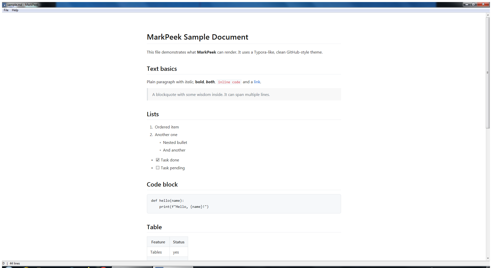

# MarkPeek

A minimal, **Typora-style Markdown viewer** for Windows.

Clean rendering, zero dependencies, one portable `.exe`. Built for **Windows 7 SP1** and **Windows 10** (32-bit binary, runs on x86 and x64).



## Features

- Typora-like clean design (centered content, GitHub-style typography)
- CommonMark + GitHub extensions: tables, task lists, strikethrough, footnotes, admonitions
- UTF-8 / UTF-16LE / UTF-16BE files
- Relative images next to the `.md` file are resolved automatically
- Drag & drop a file onto the window, or open from the command line: `MarkPeek.exe readme.md`
- `Ctrl+O` open, `F5` reload, `Ctrl+E` edit source, `Ctrl+S` save (UTF-8)
- Built-in editor: press **Ctrl+E** to switch between preview and editing, **Ctrl+S** saves the file; unsaved changes are marked with `*` in the title bar and a save prompt protects you on exit
- Hotkeys work in any keyboard layout (RU/EN)
- Optional: set MarkPeek as the default viewer for `.md` files (per-user, no admin) — the file icon comes with it
- Portable: no installer, no runtime dependencies, no registry writes except the optional file association

## Screenshot


## Download

Grab `MarkPeek.exe` from the [Releases](../../releases) page, or build it yourself (below).

## Build

Requires [MinGW-W64 i686](https://www.mingw-w64.org/) (tested with gcc 10.5.0).

```
build.bat
```

Or manually:

```
windres app.rc -O coff -o appres.o
gcc -O2 -c md4c/md4c.c      -o md4c.o
gcc -O2 -c md4c/md4c-html.c -o md4c-html.o
gcc -O2 -c md4c/entity.c    -o entity.o
g++ -O2 -c main.cpp         -o main.o
g++ main.o md4c.o md4c-html.o entity.o appres.o -o MarkPeek.exe \
    -mwindows -static -lole32 -loleaut32 -luuid -lcomctl32 -lshlwapi
```

The result is `dist\MarkPeek.exe` — a single portable file.

## How it works

- **md4c** ([mity/md4c](https://github.com/mity/md4c), MIT) converts Markdown to HTML.
- The HTML is rendered in an embedded **Internet Explorer (MSHTML)** control — present on every Windows 7/10 system, so the app needs no bundled browser engine.
- Editing uses a native Win32 edit control (Consolas, UTF-8); `Ctrl+C`/`Ctrl+A` in the preview go through the browser engine natively.
- A Typora-like theme is applied via embedded CSS (IE9-compatible).

## Project layout

```
MarkPeek/
├── build.bat          build script
├── src/
│   ├── main.cpp       the whole app (Win32)
│   ├── resource.h     icon resource id
│   ├── app.rc         icon + version info
│   └── md4c/          third-party Markdown parser (MIT, vendored)
├── assets/
│   ├── icon.png       app icon (generated with image.pollinations.ai)
│   ├── icon.ico       multi-size ICO (16..256 px)
│   └── screenshot.png
└── dist/
    └── MarkPeek.exe   portable build output
```

## License

MIT — see [LICENSE](LICENSE). md4c is MIT, see `src/md4c/LICENSE.md`.