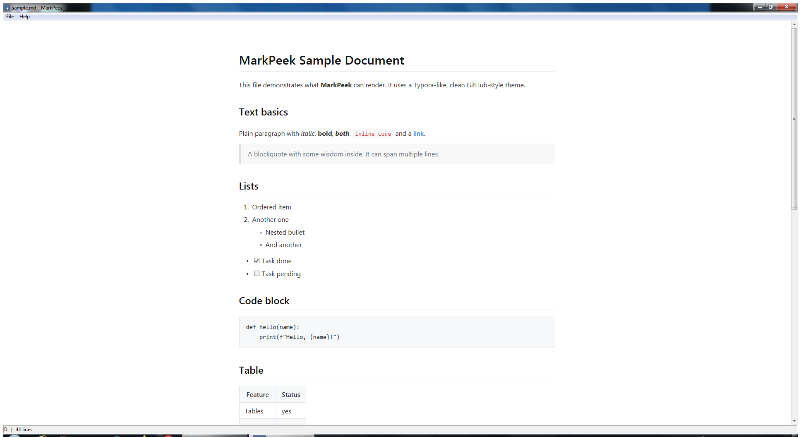

# MarkPeek

A minimal, **Typora-style Markdown viewer & editor** for Windows **and Linux**.

Clean rendering, zero bundled dependencies, one portable binary per platform.
The Windows build targets **Windows 7 SP1** and **Windows 10** (32-bit binary,
runs on x86 and x64); the Linux build ships as a portable binary and AppImage
for x86_64.



## Features

- Typora-like clean design (centered content, GitHub-style typography)
- **WYSIWYG editing**: press **Ctrl+E** and edit the rendered document directly — headings, tables and lists are edited in place, exactly as they will look in the preview, then **Ctrl+S** saves it back to Markdown
- Editing hotkeys (**Ctrl+A / Ctrl+C / Ctrl+X / Ctrl+V / Ctrl+Z / Ctrl+Y**, undo, etc.) are handled natively by the browser engine, so they work in **any keyboard layout** (RU/EN)
- Unsaved changes are marked with `*` in the title bar and a save prompt protects you on exit (Windows; Linux shows the `*` in the title bar)
- CommonMark + GitHub extensions: tables, task lists, strikethrough, footnotes
- UTF-8 / UTF-16LE / UTF-16BE files
- Relative images next to the `.md` file are resolved automatically
- Drag & drop a file onto the window, or open from the command line: `MarkPeek.exe readme.md` / `markpeek readme.md`
- `Ctrl+O` open, `F5` reload, `Ctrl+E` edit / preview, `Ctrl+S` save (UTF-8)
- Windows only: optional per-user file association for `.md` (with icon)
- Portable: no installer, no runtime dependencies (Linux needs only GTK3 + WebKit2GTK from your distro)

## Screenshot


## Download

Grab the binaries from the [Releases](../../releases) page:

- `MarkPeek-<ver>-windows-i686.exe` — Windows, portable, single file
- `markpeek-<ver>-linux-x86_64.tar.gz` — Linux portable binary
- `MarkPeek-<ver>-x86_64.AppImage` — Linux, runs on any distro

or build them yourself (below).

## Build — Windows

Requires [MinGW-W64 i686](https://www.mingw-w64.org/) (tested with gcc 10.5.0).

```
build.bat
```

Or manually:

```
windres app.rc -O coff -o appres.o
gcc -O2 -c md4c/md4c.c      -o md4c.o
gcc -O2 -c md4c/md4c-html.c -o md4c-html.o
gcc -O2 -c md4c/entity.c    -o entity.o
g++ -O2 -c main.cpp         -o main.o
g++ main.o md4c.o md4c-html.o entity.o appres.o -o MarkPeek.exe \
    -mwindows -static -lole32 -loleaut32 -luuid -lcomctl32 -lshlwapi
```

`build.bat` looks for the compiler in `C:\PORTABLE\mingw32` and falls back to a `mingw32` folder next to the project. The result is `dist\MarkPeek.exe` — a single portable file.

## Build — Linux

Requires GTK3 and WebKit2GTK development packages.

```bash
# Debian/Ubuntu
sudo apt install build-essential pkg-config libgtk-3-dev libwebkit2gtk-4.0-dev
# Fedora
sudo dnf install gtk3-devel webkit2gtk4.0-devel

make            # -> dist/markpeek
make run        # build and run
make install    # /usr/local: bin + icon + desktop entry
```

The Linux app reuses the exact editor JS and CSS from the Windows sources:
`tools/gen_shared_assets.py` extracts them into `src/shared/*.h`, and CI fails
if the generated files drift from `src/main.cpp`.

## How it works

- **md4c** ([mity/md4c](https://github.com/mity/md4c), MIT) converts Markdown to HTML.
- Windows: the HTML is rendered in an embedded **Internet Explorer (MSHTML)** control — present on every Windows 7/10 system, so the app needs no bundled browser engine.
- Linux: the same HTML is rendered in **WebKitGTK** (the engine behind Epiphany) — native on all major distros.
- Editing is **WYSIWYG**: the same rendered document is switched to `contenteditable`, so you edit what you see. On save a small script inside the page serialises the edited DOM back to Markdown (it understands the exact HTML that md4c emits for headings, paragraphs, lists, task lists, tables with alignment, block quotes, code fences, links, images and footnotes).
- A Typora-like theme is applied via embedded CSS (IE9-compatible; on Linux the page gets the same CSS with Linux font stacks).

## Project layout

```
MarkPeek/
├── build.bat              Windows build script
├── Makefile               Linux build (GTK3 + WebKitGTK)
├── src/
│   ├── main.cpp           the Windows app (Win32 + MSHTML)
│   ├── linux/
│   │   └── main_gtk.cpp   the Linux app (GTK3 + WebKitGTK)
│   ├── shared/            generated shared page assets (CSS + editor JS)
│   ├── resource.h         icon resource id (Windows)
│   ├── app.rc             icon + version info (Windows)
│   └── md4c/              third-party Markdown parser (MIT, vendored)
├── tools/
│   └── gen_shared_assets.py  regenerates src/shared/ from src/main.cpp
├── ci/
│   └── smoke_test.sh      offscreen functional test of the Linux build
├── .github/workflows/
│   └── linux-build.yml    Linux CI: build + smoke test + AppImage + release upload
├── assets/
│   ├── icon.svg           app icon source (hand-drawn vector)
│   ├── icon.png           app icon (rendered from icon.svg)
│   ├── icon.ico           multi-size ICO (16..256 px)
│   ├── markpeek.desktop   Linux desktop entry
│   └── screenshot.png
└── dist/
    ├── MarkPeek.exe       Windows build output
    └── markpeek           Linux build output
```

## License

MIT — see [LICENSE](LICENSE). md4c is MIT, see `src/md4c/LICENSE.md`.
